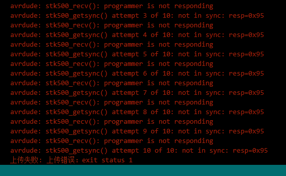

# Two days task: Arduino on a board

## Overview
This is the first week of Studio5. This week, we learnt about how to build Arduino on a board.

## Preparation

First, we need some materials to wire up Arduino:
* A breadboard
* 17 wires
* 7805 Voltage regulator
* At least 1 LED
* 1 1k Ohm resistor
* 1 10K Ohm resistor
* 2 ?uF capacitors
* 2 ?uF capacitors
* 2 22pF capacitors
* 16 MHz clock crystal
* USB
* Atmega Chips

## Adding circuitry for a power supply

Add power and ground wires and the 7805 and decoupling capacitors.

The regulator is a TO-220 package where the Input from the external power supply goes input on the left, ground is in the middle and the 5V output is on the right (when facing the front of the regulator). Add power OUT and ground wires that connect to the right and left rails of the breadboard.

Add power and ground wires at the bottom of your board connecting each rail.

## Adding ATMEGA
Before this step we need to know the function of each pin of ATMEGA.

Then, we add ATMEGA on the board.
** Be careful! There is a small semicircular incision at one end of the head of the ATMEGA. **

## Adding supporting circuitry for ATMEGA

Connect the GND pin to the negative side of the power supply.
Connect the VCC pin to the positive side of the power supply. Also the AREF pin and AVCC pin are the same.
Then add a capacitor between VCC and GND for further stabilization of the current.

## Adding a LED

Add a LED and a 1K Ohm resistor into circuit. It can tell us if there is a current in the circuit.
** Attention! The longer leg of LED is positive and the shorter one is negative. **
** Also, you can make a judgement through its shape. The round side is positive, the flat side is negative. **

## Add the Clock & Caps

Add a 16 MHz external clock between pin 9 and 10, and add two 22 pF capacitors running to ground from each of those pins.

## Adding USB

Before connecting USB to the board, we should use a 10K Ohm resistor to link the first pin of ATMEGA with positive. 

We connect the USB to the board according to the following rules:
* DTR -> RESET
* RXD -> TXD
* TXD -> RXD
* VCC -> VCC
* GND -> GND

*DTR means Data Terminal Ready and indicates that the connected device is ready to receive data
*RXD means Receive Data
*TXD means Transmit Data

Then add a ?uF capacitor between positive and DTR pin of USB.

## Connecting with computer
Now the Arduino on a board is ready.

Add a LED , connect with computer and try out the Blink programme of the examples.

### Choosing board & port

### Uploading programme

Oops, whats going on? It's stuck in this state for a second.

After a long time it finally came out. But it doesn't look right.

I've tried almost every solution. I have tried repalcing USB, ATMEGA, computer.
Finally, I found that I made a mistake. I put the clock crystal and capacitors into wrong place.

I finally got it to work after moving it one pin to the left.

