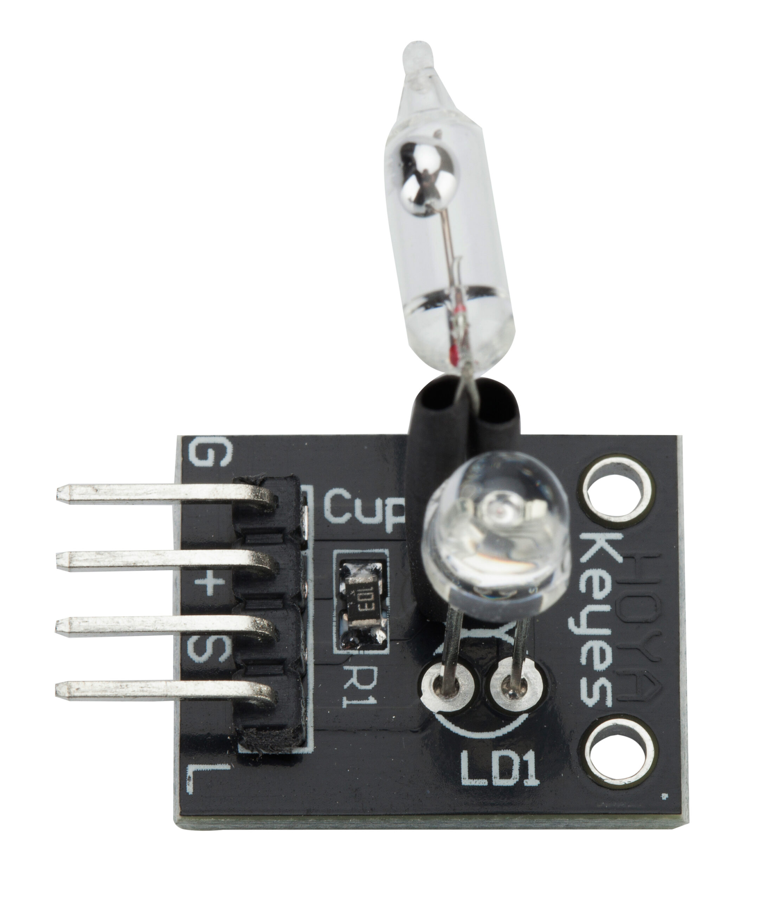
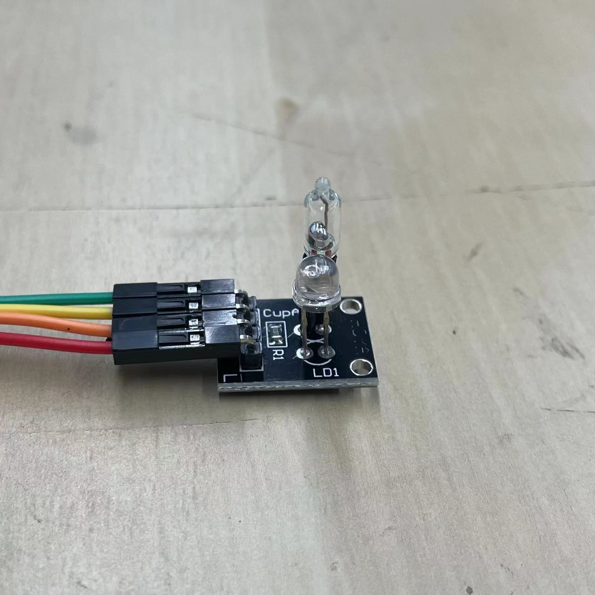
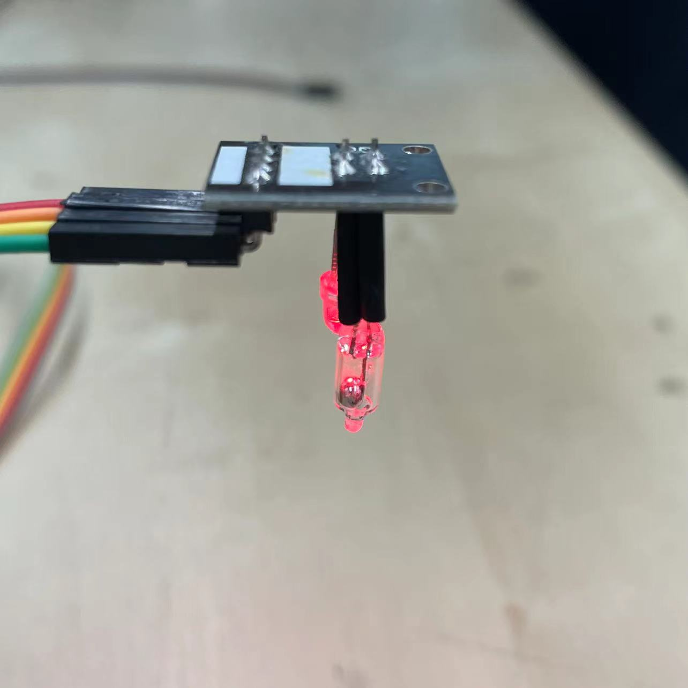
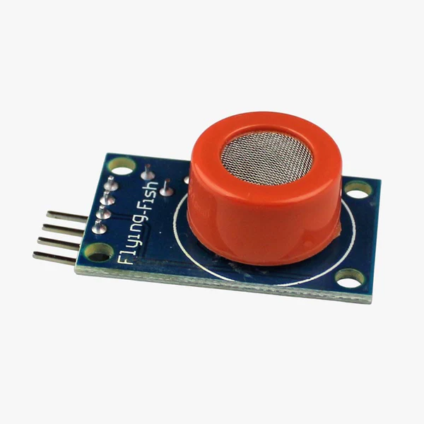

# Input devices try-out

## Brief
Experience data collection with digital and analog input devices. We are asked to pick a digital sensor and a analog sensor from a collection and try then out with the prototyping breadboard, connect the sensors to the suitable pin-headers,  test them with a program and read the sensors’ data using the Serial Monitor. 

I chose a KY-027 mercury switch for digital and a MQ3 alcohol sensor for analog.

## KY-027 mercury switch

### Principle

This is a module which consists of a mercury switch and a LED.

It has 4 pins. From top to bottom are:
* GND
* VCC
* Signal
* LED

When we turn over this switch, the mercury drop connects the circuite and sents the signal to ATMEGA. Then we can use the signal to control the LED.

### Code
```ruby
int switch = 0; // Define an variable for switch.

void setup() {
  pinMode(2,INPUT); // Receive the signal from mercury switch.
  pinMode(13,OUTPUT); // Power for the LED.
}

void loop() {
  switch = digitalRead(2); // Receive the signal from mercury switch.

  if(switch == 1){
    digitalWrite(13,HIGH); // When the switch is on, turn on the LED.
  }
  else{
    digitalWrite(13,LOW); // Otherwise turn off the LED.
  }
}
```

### Present



## MQ3 alcohol sensor

### Principle

MQ3 alcohol sensor is a metal oxide semiconductor (MOS) type sensor. This metal oxide changes its resistance when exposed to different concentrations of alcohol. 

**This sensor needs to work at high temperatures. So when we turn on the circuit we need to wait a while for the sensor to warm up before we start using it.**

It has 4 pins. From top to bottom are:
* GND
* VCC
* Analog
* Digital

This module can output two types of signals, digital and analog. I just used the analog pin.

### Code
```ruby
float alcoholvalue = 0; // Define an variable for alcohol.

void setup() {
  pinMode(A0,INPUT);
  Serial.begin(9600);
  Serial.println("MQ-3 is warming up!"); // Indicate that the sensor is warming up.
  delay(20000); // Waiting for warm-up time.
}

void loop() {
  alcoholvalue = analogRead(A0);
  Serial.print("Sensor Value:");
  Serial.println(alcoholvalue); // Display of alcohol concentration.
  delay(1000);
}
```

### Present


### Result

The normal circumstance.


When I take a sip of wine and then blow on it.

## Reference
[【雕爷学编程】Arduino动手做（132）---KY-027魔术光环模块](https://zhuanlan.zhihu.com/p/640036912)

[MQ3酒精传感器如何工作及其与Arduino接口](https://zhuanlan.zhihu.com/p/340078614)
