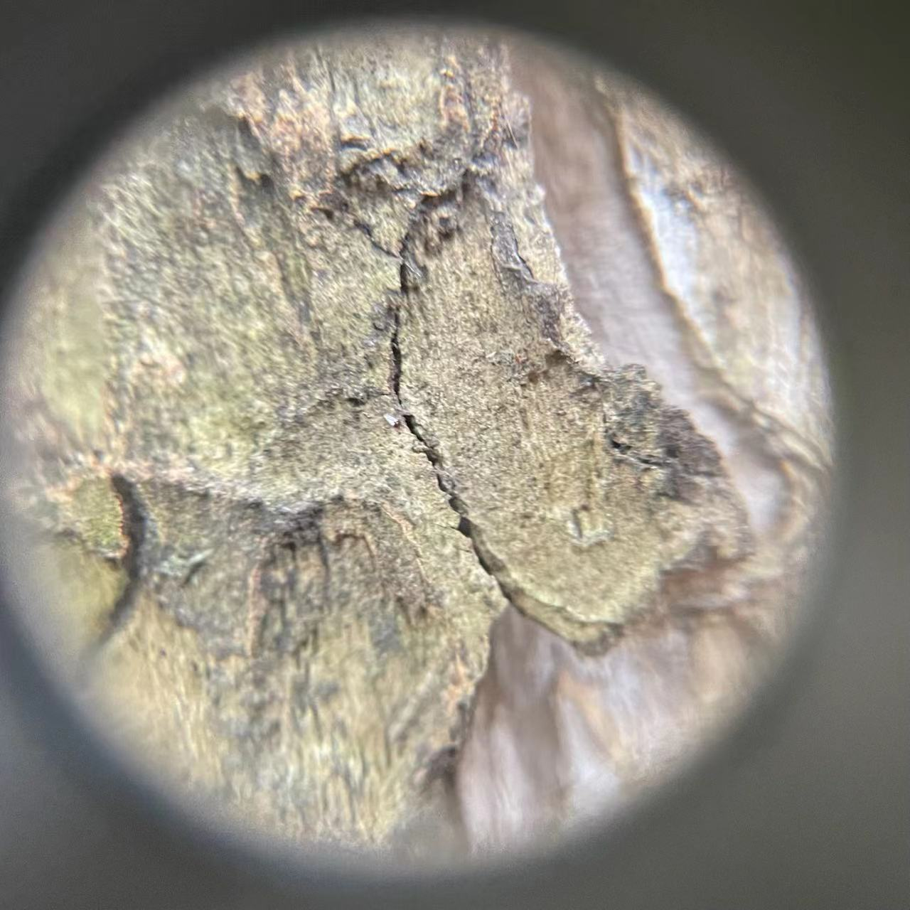
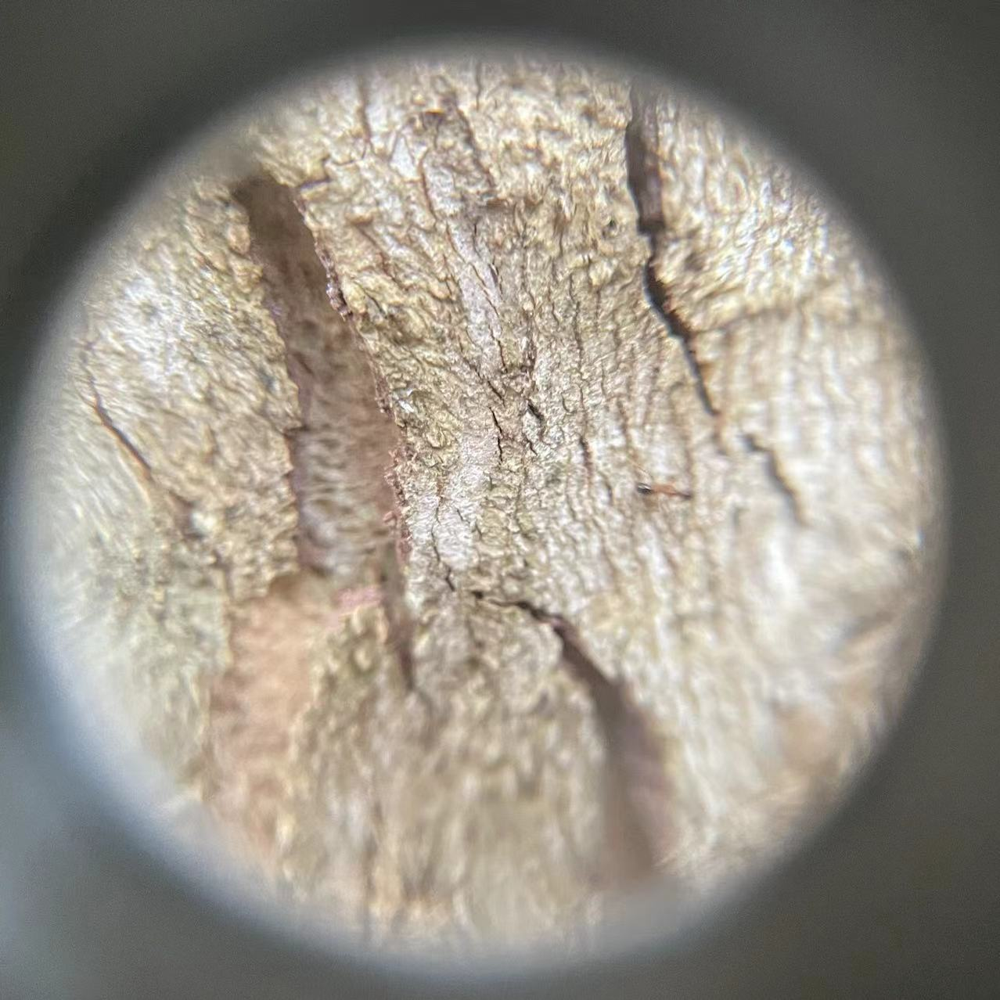
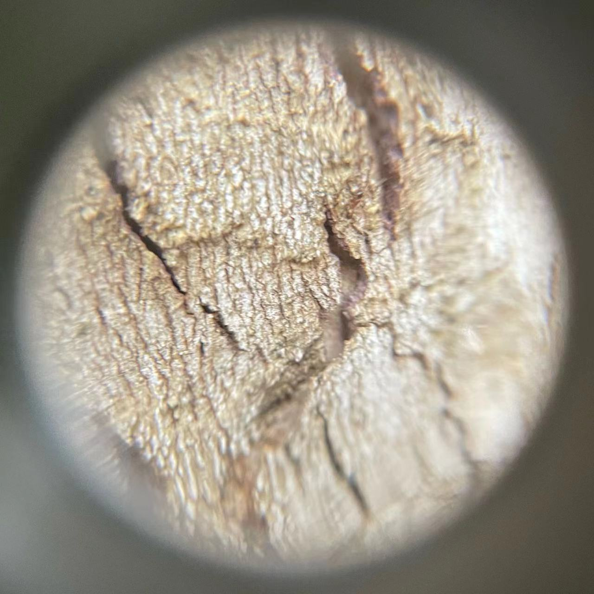
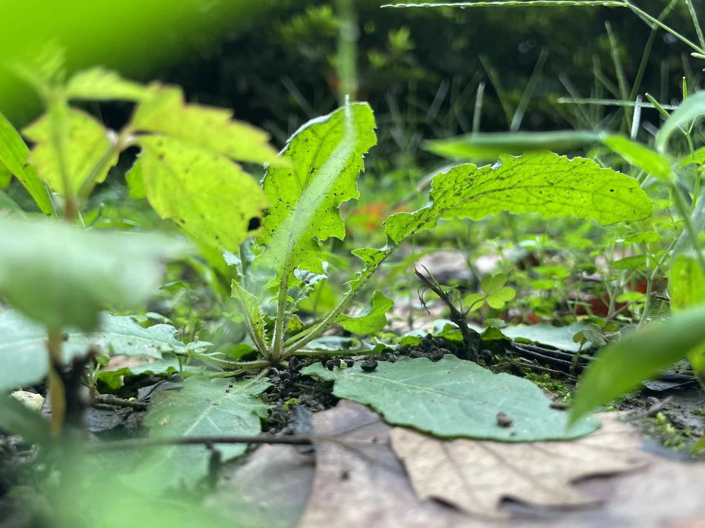
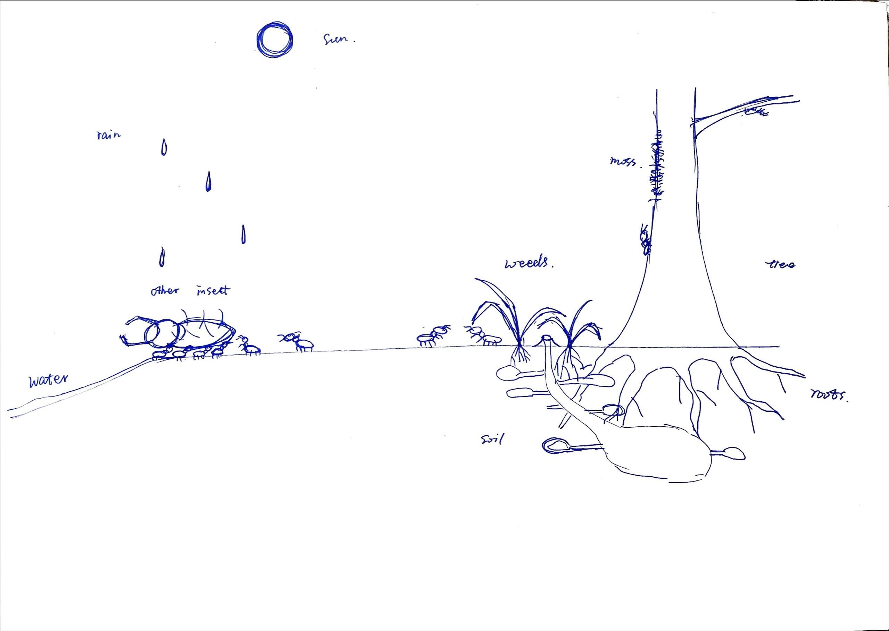
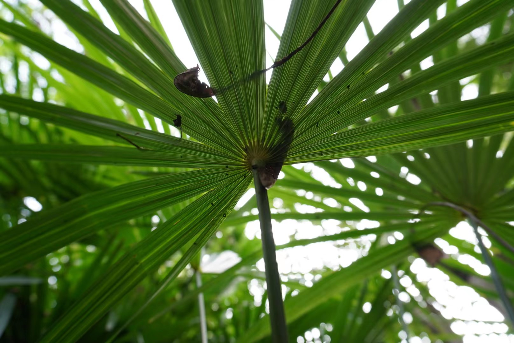
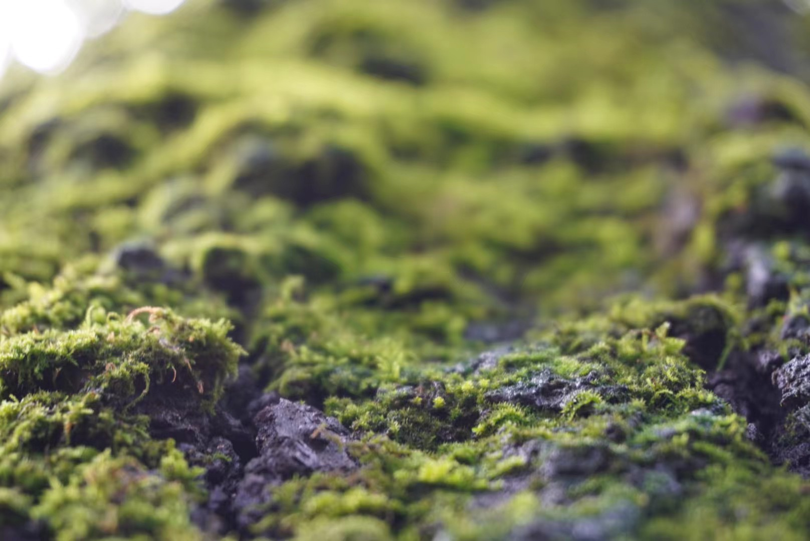

# Explore in the urban nature

## Assignment's description
Engage in the deep observation of the ecosystem, focusing on the perception of ecological relationships. Try to obtain a “change of scale”, analysing how the environment is perceived by all five senses. Look at relationships between elements rather than single entities.

## Exploration

### 9.21

For reasons of human's own scale, people seldom look at urban nature from some microscopic point of view. But to an ant, a small plant may be their big tree, and a cracked bark is a canyon.

Ants are very sensitive to humidity. When there is an increase in moisture in the air, ants feel uncomfortable because it affects their respiration and metabolism.

Ants can sense air pressure through their tentacles. The antennae have a special type of receptor called mechanoreceptor, which senses the force and pressure exerted on the antennae from outside.

Ants can perceive light through vision. Vision is another important sense organ of ants, they are located on both sides of the head and consist of two compound eyes and three single eyes. The compound eyes consist of many small eyes, each with its own lens and photoreceptor cells. The compound eyes can be used to detect the shape and color of the surroundings. The single eye is located in the center of the head and consists of a lens and a number of photoreceptor cells. The single eye can be used to detect the brightness and direction of the surroundings.

Ants can communicate through pheromones. Pheromones are chemicals secreted by living organisms that can influence the behavior or physiological state of their own kind or other species. Ants can communicate various information through pheromones, such as food sources, danger warnings, and courtship invitations.

### 9.26

Due to the limitations of human bodily functions, we can only walk on relatively flat surfaces. So we will observe the world more from a horizontal perspective. In our conception, the horizontal direction is called the floor and the vertical direction is called the wall. But for bugs, walls and even ceilings are just extensions of the ground. Compared to us, they are able to feel the gravity from different angles more freely.
