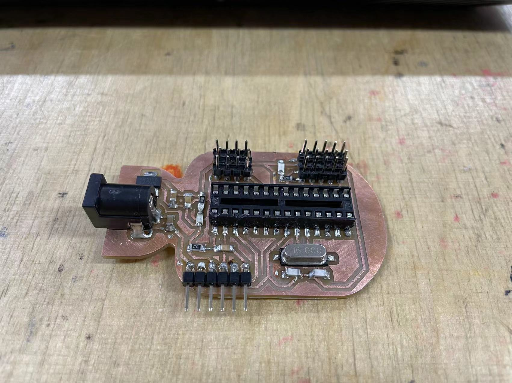
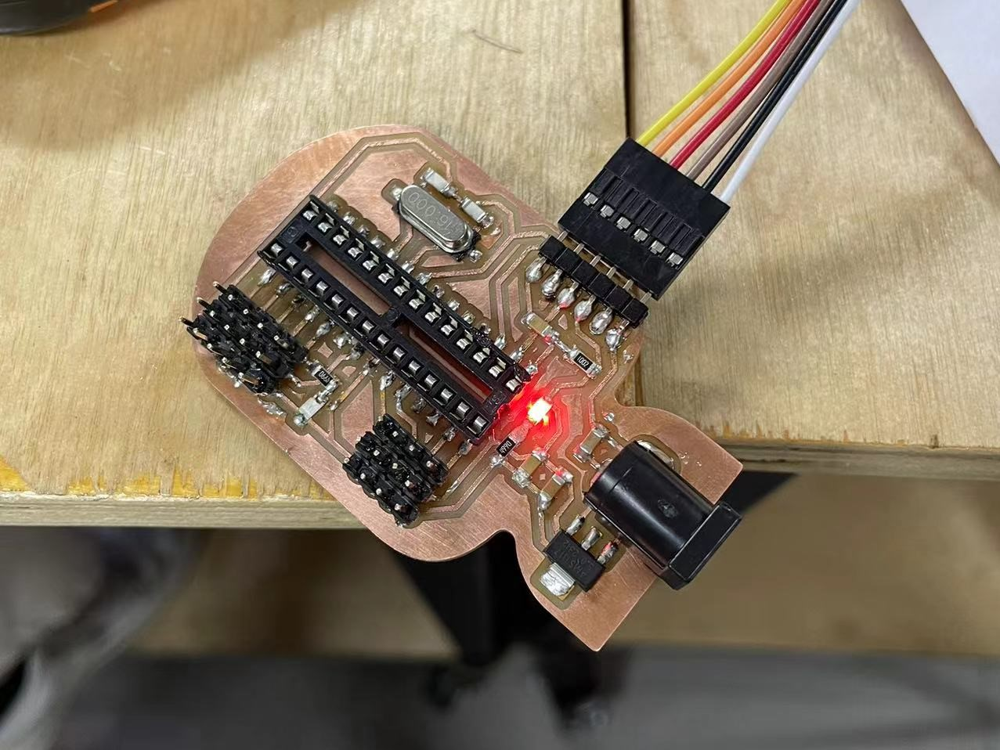

# CNC Milling

## Assignment's description
We learnt how to design our own arduino pcb board with EasyEDA. And then we milt the board with the CNC milling machine. Finally, we soldered the components to the pcb board.
[description of the website](https://pro.easyeda.com/editor)

## PCB making

### Project design in EasyEDA
After sign up/sign in and creating a new project, we can start our design.

1. Add all the components we need in the Schematic.
We need:
* ATMEGA
* Voltage regulator
* LED
* Resistors
* Capacitors
* Crystal
* Pins

2. And connecting components to the correct pins.

Here is the outcome:

3. Updata/Convert Schematic to PCB.

4. Arrange the placement of your components and follow the prompts to connect them.
   We can place our components around the ATMEGA.

6. Draw/Import an outline you like of your PCB.
   I drew the outline in the shape of a bomb.

Here is the outcome:

### Explore documents for milling
Now, we can do some preparation for milling the PCB.

First, We export the PDF with a single page PDF and choose color white on black. Then, we only need to print top layer, hole layer and PCB outline layer.

Second, we used Adobe Illustrator to split this pdf into three layers:

The trace layer.

The hole layer.

The outline layer.

In this step, we need to make sure the PNGs we export are in the same size.

Third, we use *mods CE* to generate the milling files.
[description of the website](https://modsproject.org/)

In our lab, we use 1/64 inch milling drill to cut the trace and 1/32 inch milling drill to cut holes and the outline.

Here is the outcome:

### Cutting board
First, we import the trace file to the software and cutting with 1/64 inch drill. After that was done, we replace the 1/32 inch drill, import files of hole and outline and start cutting.

### Soldering components
After cutting PCB, we need some tools to soldering components.
* Soldering iron
* Tweezer

And, we need to make a list of components according to our needs.

Final, it will be like this:

### Somking test
Finally, let's verify that our board can be successfully energized.

Great, it didn't start smoking and the light came on. We did it.
