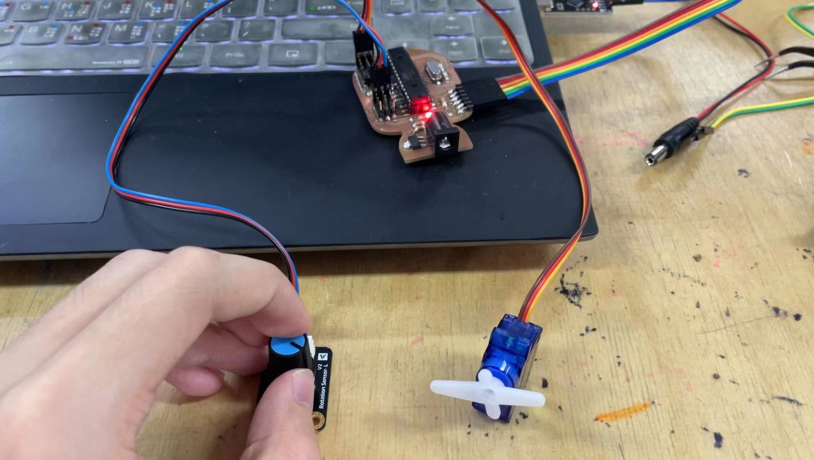
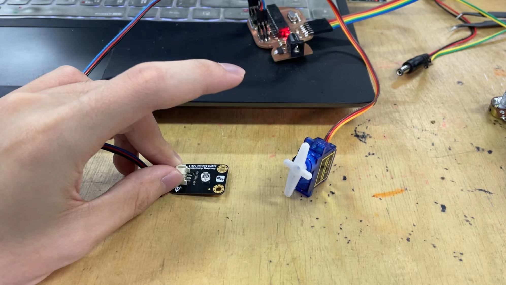
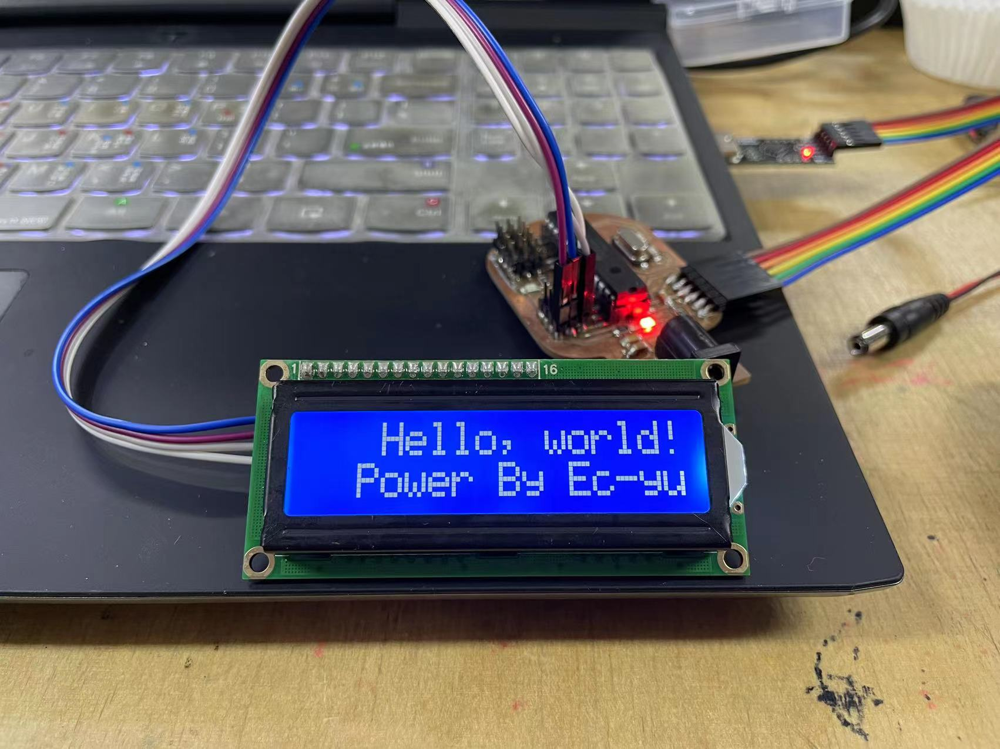

# Acruator

## Abstract
In this class, our professor taught us to use some simple actuators with our own PCB we have done last week. 

We did two experiments: One is to control a motor as an output device by using an input device, the other is to display some information on a LiquidCrystalDisplay screen.

## Experiments

### Controling a motor
First, we install a library called *Servo*. We use the example named *knob* in this library. Then, we connect a motor and a varistor to our PCB.  Final, we upload the code to the board and we can control the motor by using this varistor.

What's more, I try another light sensor as an input device. When the brightness change, the motor rotates to different angles.

### Showing on the LCD
First, we also need to install a library, *LiquidCrystal I2C*. Then we can use the exmaple *Hello World* in this library to learn how to display some information.

But before this, we should connect the screen to our board and run the example *Scroll* in the library *LiquidCrystal*, Which can help us to figure out the address of our screen. With this address, we can let the communicate properly with our computers.

