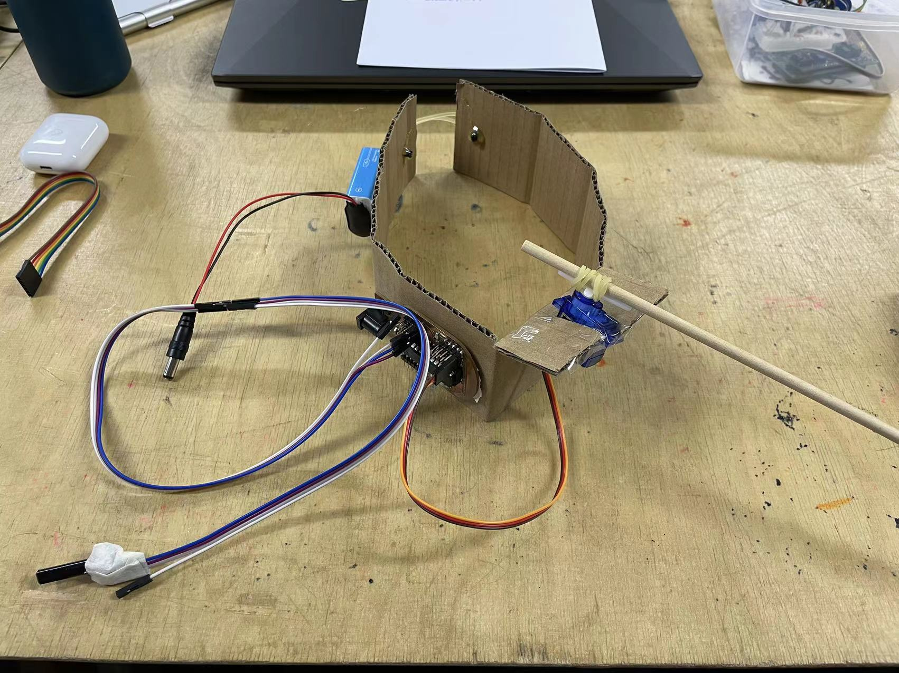
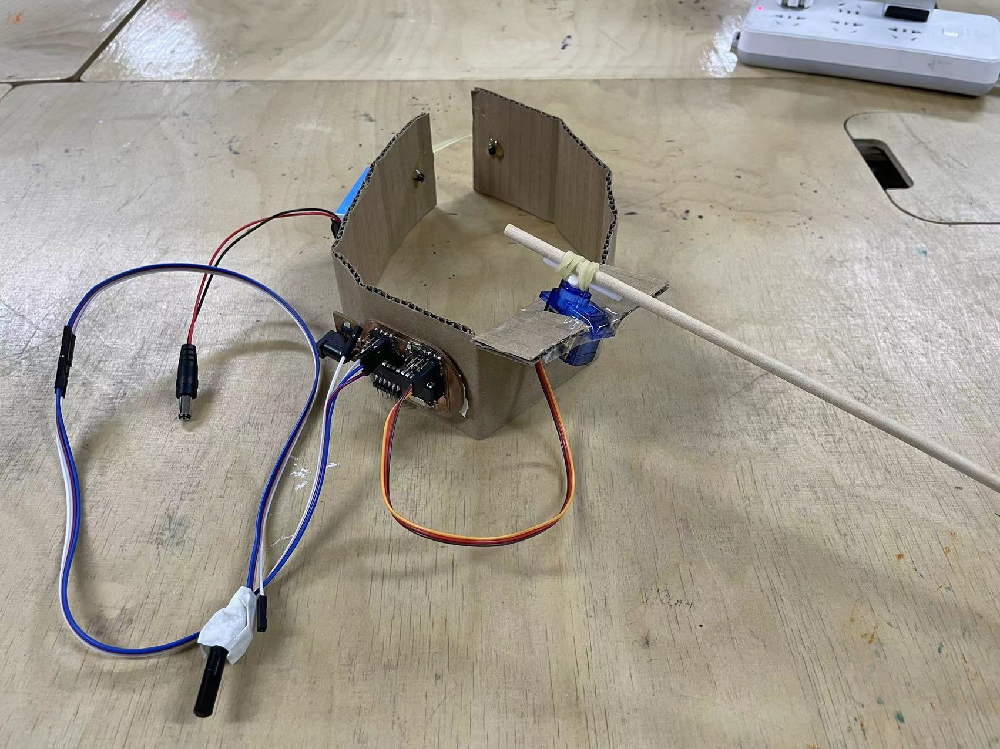

# Very Rapid Prototyping

## Description
Today we are asked to make a very rapid prototype about our final project in the next week by using some recycle material.

My preliminary concept is about simulate ants' action of find their way. 

## Presenting
I made a headset device.

I use cardboard to form it boody, a motor with a stick to tell the direction, and use a simple device to control its direct.

