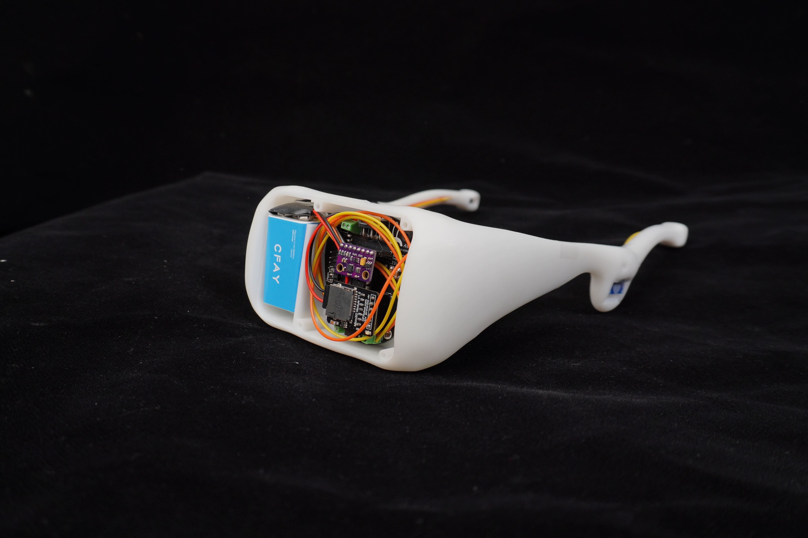
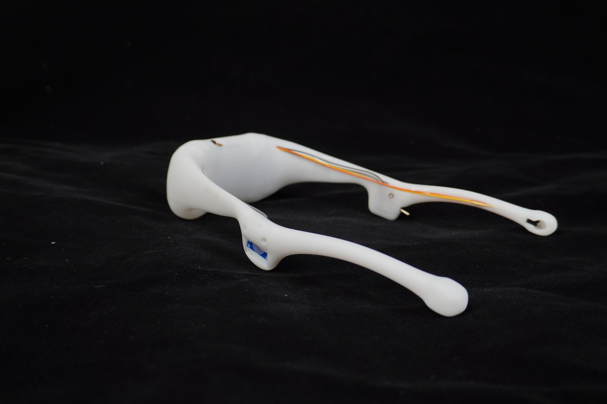
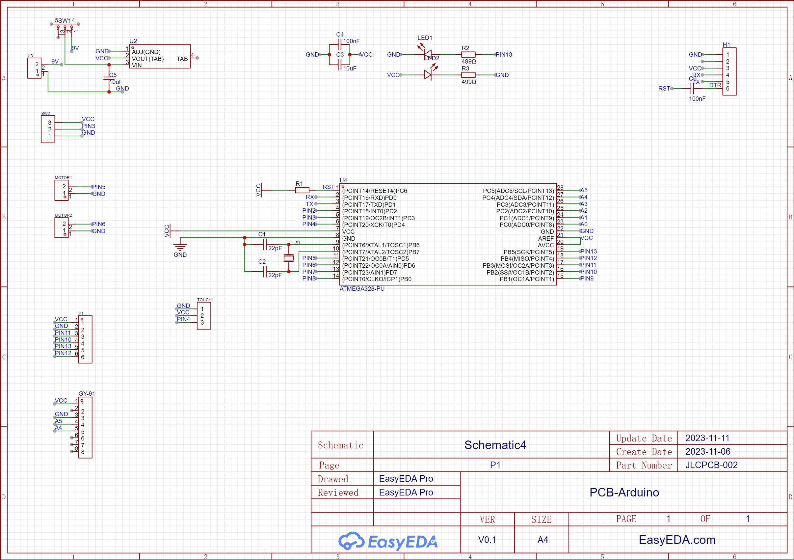
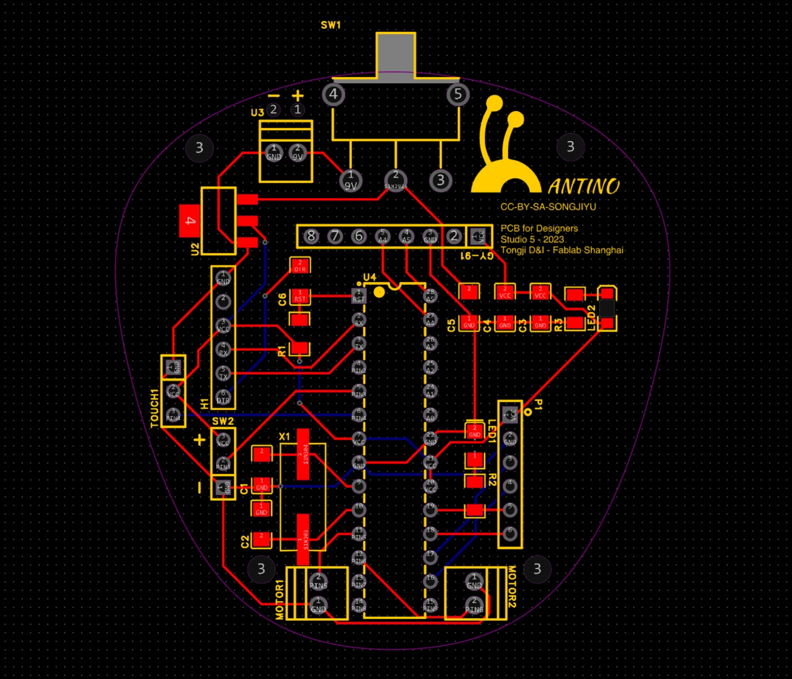
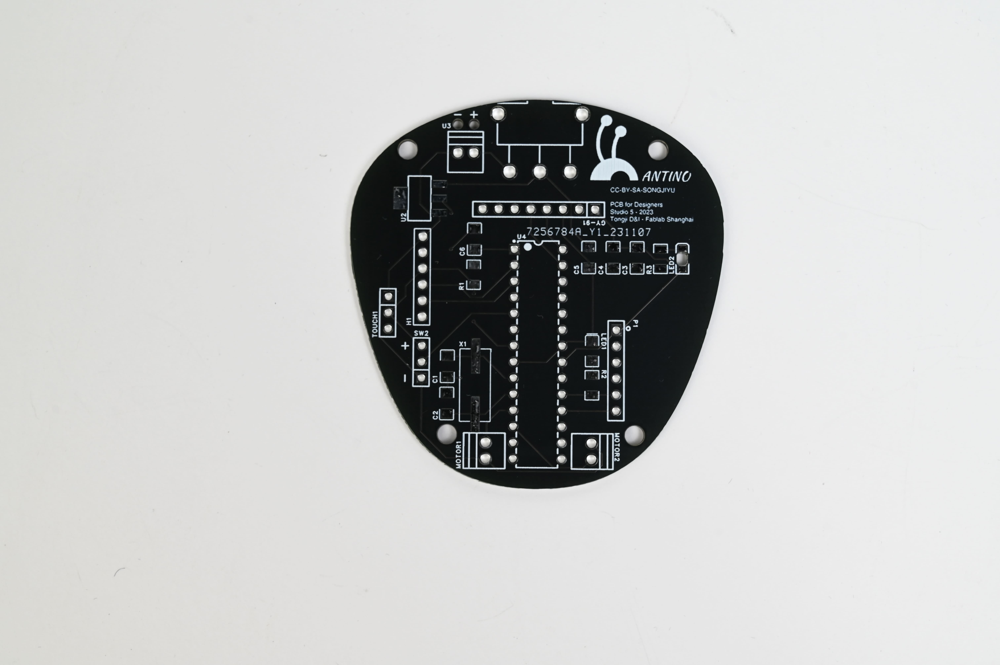
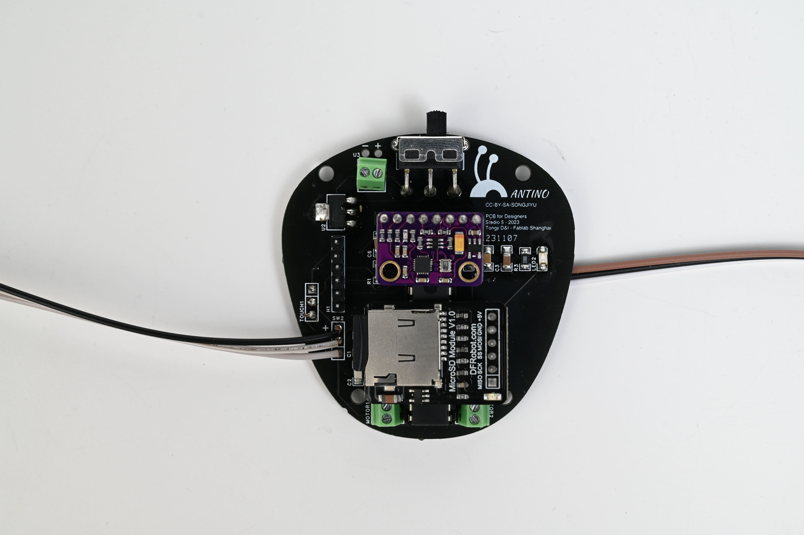
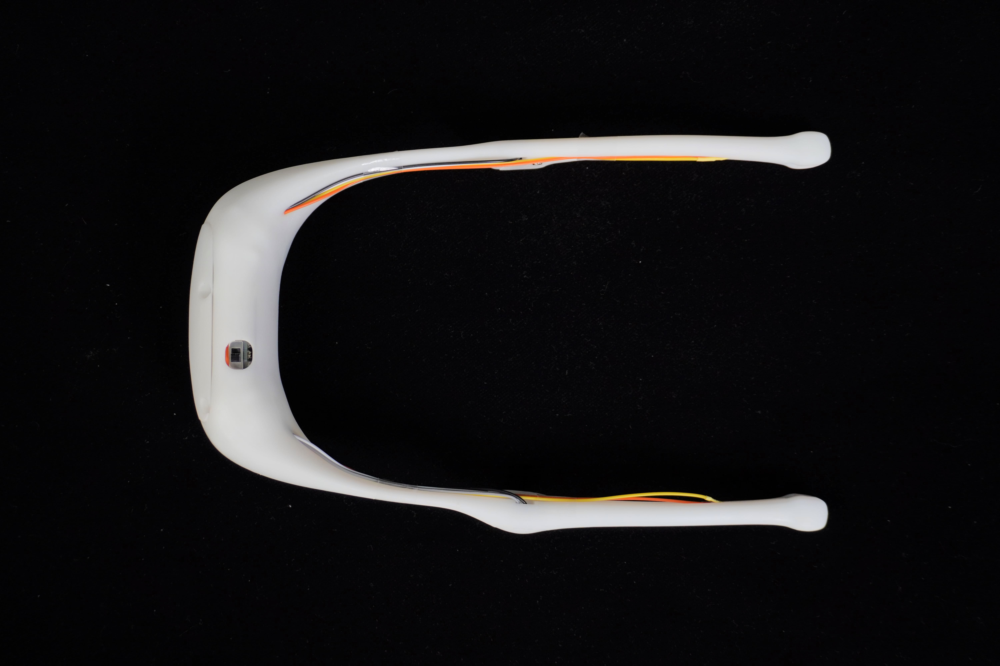
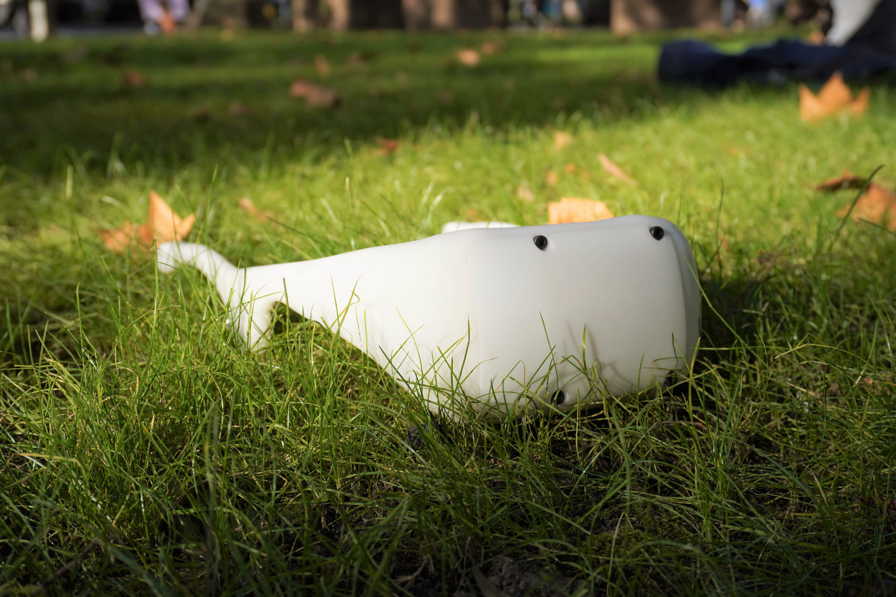
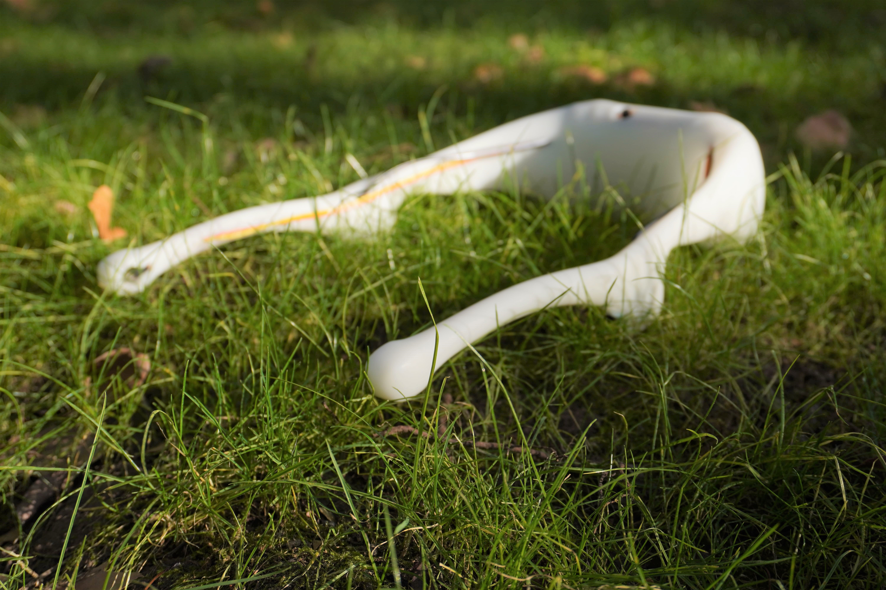
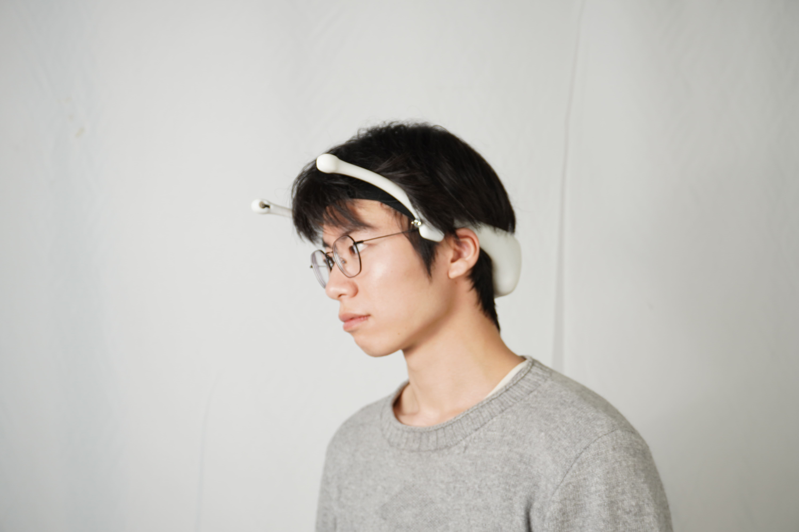

# Final Project

## inspiration
When I was exploring in urban nature, I focused my attention on insects like ants, and I felt attracted and inspired by their ability to track pheromones following a route based on the last ant. 

I wanted to make a device that had a similar mechanism. The aim is to generate interest among people for these ubiquitous insects found in both urban and natural environments.

## Description
This device is a head-worn apparatus with a biomimetic design resembling ant antenna. Its purpose is to emulate the navigation function among ants, which involves the exchange of pheromones to communicate path information. It utilizes an accelerometer to record the deviation angles and distances between path points, and employs a vibration motor to signal changes in direction. 

It has two modes, the first is track record. Touch the touch sensor to record the orientation angle and the distance travelled. Then there's vibration feedback at the two antennas. 

The second mode is track read. After travelling a recorded distance to reach the checkpoint, the tentacles on both sides will vibrate simultaneously. Touch the touch sensor to read the next set of azimuths and forward distances. One-sided tentacles vibrate to indicate the correct angle of steering.

## Content of Making Process
This file editing was done on Jialichuang's EasyEDA platform.
[JLC page of my project](https://www.https://https://u.easyeda.com/join?type=project&key=9ce47903dabc406eaa57221c2913183e&inviter=19f5151768ee47feb61f9181e9382d84/)

### Circuit Board Drawing
Schematic page

PCB page

### PCB soldering

### Source Code

## Product Picture
Top-View

Front-View

